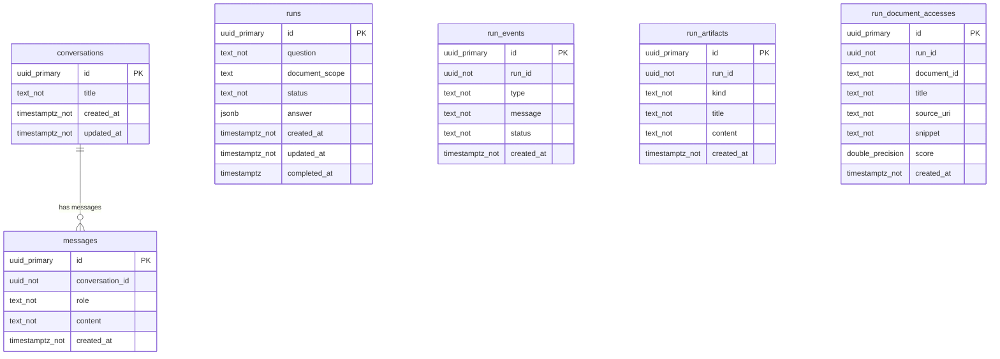

<!-- 自動生成・直接編集禁止: npm run docs:generate で更新 -->

# AIチャット データベース定義

このファイルは `apps/api/src/db.ts` と `db/docs-metadata.json` から自動生成されています。

## ER 図



## CRUD 図

| API / 処理 | conversations | messages | runs | run_events | run_artifacts | run_document_accesses |
| --- | --- | --- | --- | --- | --- | --- |
| GET /api/conversations | R |  |  |  |  |  |
| POST /api/conversations | C |  |  |  |  |  |
| GET /api/conversations/{id}/messages |  | R |  |  |  |  |
| POST /api/chat | C/R/U | C/R |  |  |  |  |

## テーブル定義

### conversations

チャット会話のタイトルと更新時刻を保持する。

| Column | Definition |
| --- | --- |
| `id` | `uuid primary key` |
| `title` | `text not null default 'New chat'` |
| `created_at` | `timestamptz not null default now()` |
| `updated_at` | `timestamptz not null default now()` |

#### Constraints

- なし

#### Indexes

- なし

### messages

会話に紐づく user / assistant メッセージ本文を保持する。

| Column | Definition |
| --- | --- |
| `id` | `uuid primary key` |
| `conversation_id` | `uuid not null references conversations(id) on delete cascade` |
| `role` | `text not null check (role in ('user', 'assistant'))` |
| `content` | `text not null` |
| `created_at` | `timestamptz not null default now()` |

#### Constraints

- なし

#### Indexes

- `messages_conversation_created_idx`: `conversation_id, created_at`

### runs


| Column | Definition |
| --- | --- |
| `id` | `uuid primary key` |
| `question` | `text not null` |
| `document_scope` | `text` |
| `status` | `text not null check (status in ('queued', 'running', 'completed', 'failed'))` |
| `answer` | `jsonb` |
| `created_at` | `timestamptz not null default now()` |
| `updated_at` | `timestamptz not null default now()` |
| `completed_at` | `timestamptz` |

#### Constraints

- なし

#### Indexes

- なし

### run_events


| Column | Definition |
| --- | --- |
| `id` | `uuid primary key` |
| `run_id` | `uuid not null references runs(id) on delete cascade` |
| `type` | `text not null` |
| `message` | `text not null` |
| `status` | `text not null check (status in ('queued', 'running', 'completed', 'failed'))` |
| `created_at` | `timestamptz not null default now()` |

#### Constraints

- なし

#### Indexes

- `run_events_run_created_idx`: `run_id, created_at`

### run_artifacts


| Column | Definition |
| --- | --- |
| `id` | `uuid primary key` |
| `run_id` | `uuid not null references runs(id) on delete cascade` |
| `kind` | `text not null` |
| `title` | `text not null` |
| `content` | `text not null` |
| `created_at` | `timestamptz not null default now()` |

#### Constraints

- なし

#### Indexes

- `run_artifacts_run_created_idx`: `run_id, created_at`

### run_document_accesses


| Column | Definition |
| --- | --- |
| `id` | `uuid primary key` |
| `run_id` | `uuid not null references runs(id) on delete cascade` |
| `document_id` | `text not null` |
| `title` | `text not null` |
| `source_uri` | `text not null` |
| `snippet` | `text not null` |
| `score` | `double precision not null` |
| `created_at` | `timestamptz not null default now()` |

#### Constraints

- なし

#### Indexes

- `run_document_accesses_run_created_idx`: `run_id, created_at`


## DDL

```sql
create table if not exists conversations (
  id uuid primary key,
  title text not null default 'New chat',
  created_at timestamptz not null default now(),
  updated_at timestamptz not null default now()
);

create table if not exists messages (
  id uuid primary key,
  conversation_id uuid not null references conversations(id) on delete cascade,
  role text not null check (role in ('user', 'assistant')),
  content text not null,
  created_at timestamptz not null default now()
);

create index if not exists messages_conversation_created_idx
  on messages(conversation_id, created_at);

create table if not exists runs (
  id uuid primary key,
  question text not null,
  document_scope text,
  status text not null check (status in ('queued', 'running', 'completed', 'failed')),
  answer jsonb,
  created_at timestamptz not null default now(),
  updated_at timestamptz not null default now(),
  completed_at timestamptz
);

alter table runs
  add column if not exists document_scope text;

create table if not exists run_events (
  id uuid primary key,
  run_id uuid not null references runs(id) on delete cascade,
  type text not null,
  message text not null,
  status text not null check (status in ('queued', 'running', 'completed', 'failed')),
  created_at timestamptz not null default now()
);

create index if not exists run_events_run_created_idx
  on run_events(run_id, created_at);

create table if not exists run_artifacts (
  id uuid primary key,
  run_id uuid not null references runs(id) on delete cascade,
  kind text not null,
  title text not null,
  content text not null,
  created_at timestamptz not null default now()
);

create index if not exists run_artifacts_run_created_idx
  on run_artifacts(run_id, created_at);

create table if not exists run_document_accesses (
  id uuid primary key,
  run_id uuid not null references runs(id) on delete cascade,
  document_id text not null,
  title text not null,
  source_uri text not null,
  snippet text not null,
  score double precision not null,
  created_at timestamptz not null default now()
);

create index if not exists run_document_accesses_run_created_idx
  on run_document_accesses(run_id, created_at);
```
