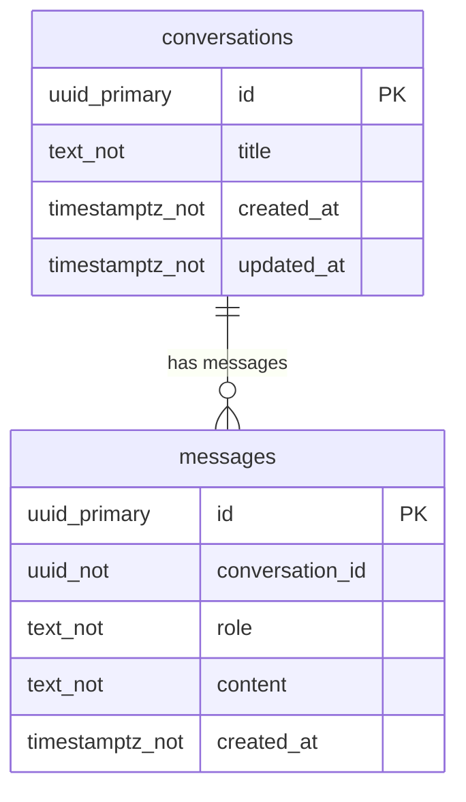

<!-- 自動生成・直接編集禁止: npm run docs:generate で更新 -->

# AIチャット データベース定義

このファイルは `apps/api/src/db.ts` と `db/docs-metadata.json` から自動生成されています。

## ER 図



## CRUD 図

| API / 処理 | conversations | messages |
| --- | --- | --- |
| GET /api/conversations | R |  |
| POST /api/conversations | C |  |
| GET /api/conversations/{id}/messages |  | R |
| POST /api/chat | C/R/U | C/R |

## テーブル定義

### conversations

チャット会話のタイトルと更新時刻を保持する。

| Column | Definition |
| --- | --- |
| `id` | `uuid primary key` |
| `title` | `text not null default 'New chat'` |
| `created_at` | `timestamptz not null default now()` |
| `updated_at` | `timestamptz not null default now()` |

#### Constraints

- なし

#### Indexes

- なし

### messages

会話に紐づく user / assistant メッセージ本文を保持する。

| Column | Definition |
| --- | --- |
| `id` | `uuid primary key` |
| `conversation_id` | `uuid not null references conversations(id) on delete cascade` |
| `role` | `text not null check (role in ('user', 'assistant'))` |
| `content` | `text not null` |
| `created_at` | `timestamptz not null default now()` |

#### Constraints

- なし

#### Indexes

- `messages_conversation_created_idx`: `conversation_id, created_at`


## DDL

```sql
create table if not exists conversations (
  id uuid primary key,
  title text not null default 'New chat',
  created_at timestamptz not null default now(),
  updated_at timestamptz not null default now()
);

create table if not exists messages (
  id uuid primary key,
  conversation_id uuid not null references conversations(id) on delete cascade,
  role text not null check (role in ('user', 'assistant')),
  content text not null,
  created_at timestamptz not null default now()
);

create index if not exists messages_conversation_created_idx
  on messages(conversation_id, created_at);
```
