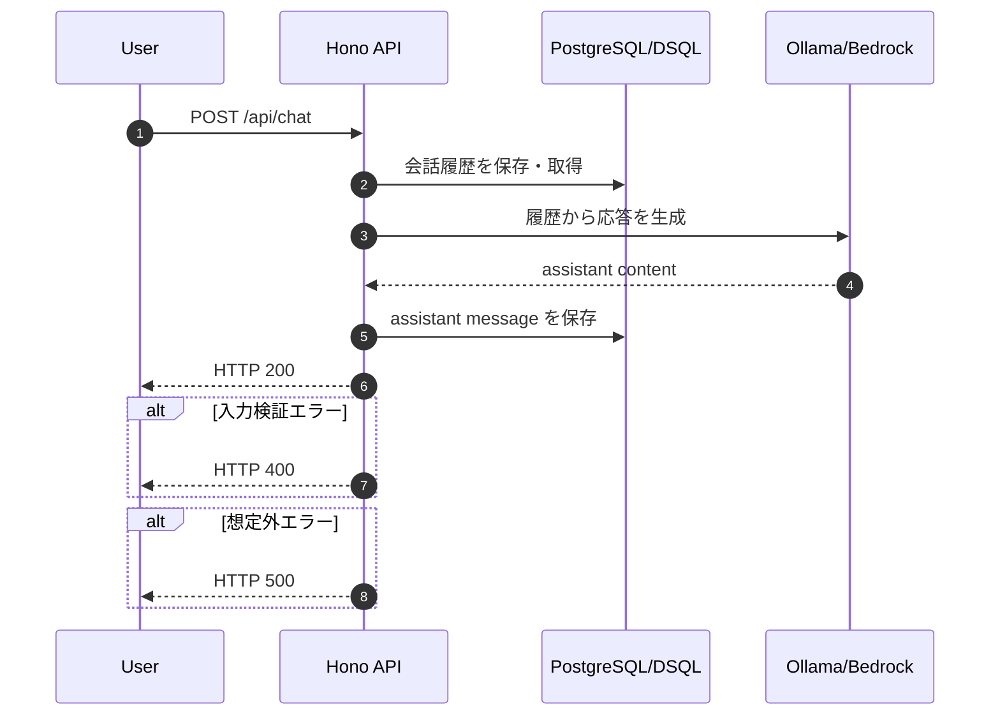

<!-- 自動生成・直接編集禁止: npm run docs:generate で更新 -->

# postChat sequence

```mermaid
sequenceDiagram
  autonumber
  participant User as User
  participant API as Hono API
  participant DB as PostgreSQL/DSQL
  participant LLM as Ollama/Bedrock
  User->>API: POST /api/chat
  API->>DB: 会話履歴を保存・取得
  API->>LLM: 履歴から応答を生成
  LLM-->>API: assistant content
  API->>DB: assistant message を保存
  API-->>User: HTTP 200
  alt 入力検証エラー
    API-->>User: HTTP 400
  end
  alt 想定外エラー
    API-->>User: HTTP 500
  end
```
